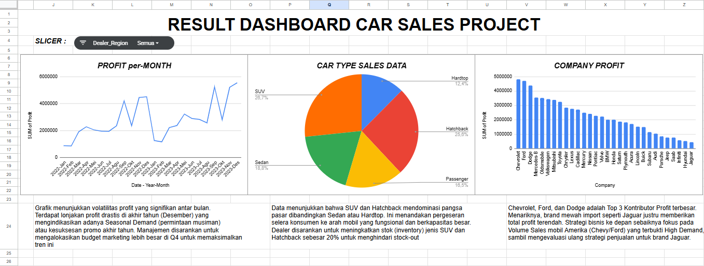

# 🚗 Automotive Sales Intelligence Project

## 📌 Project Overview
Proyek Data Analytics *end-to-end* yang mensimulasikan proses bisnis di sebuah dealer mobil. Proyek ini mencakup siklus lengkap data: mulai dari pembersihan data mentah yang "kotor" menggunakan Python, penyimpanan ke Database SQL, hingga visualisasi Business Intelligence menggunakan Dashboard Interaktif.

Tujuan utamanya adalah mengubah data penjualan mentah menjadi wawasan strategi bisnis yang dapat ditindaklanjuti.

## 📂 About the Dataset
Dataset yang digunakan dalam proyek ini adalah **"Car Sales Report"** milik **Vasu_Avasthi**.
* **Nama Dataset:** Car Sales Report
* **Sumber:** [Kaggle - Car Sales Report](https://www.kaggle.com/datasets/missionjee/car-sales-report)
* **Deskripsi:** Dataset ini berisi data historis penjualan mobil yang mencakup kolom seperti *Company, Model, Engine, Date, Price, Dealer Name,* dan lain-lain.
* **Tantangan Data (Data Cleaning):** Dataset mentah memiliki masalah *encoding characters* pada kolom `Engine` (contoh: `Double Overhead Camshaft`) dan format tanggal yang tidak konsisten, yang telah diselesaikan melalui proses ETL Python di proyek ini.

## 🛠️ Tech Stack & Workflow
1.  **Python (Pandas & NumPy):** * Membersihkan *Encoding Error* (`DoubleÂ`) pada tipe mesin.
    * Standardisasi format Tanggal & Tipe Data.
    * Menangani *Missing Values*.
2.  **SQL (MySQL):** * Data Warehousing.
    * Analisis Lanjut menggunakan *Window Functions* (`DENSE_RANK`) untuk ranking dealer.
    * Segmentasi Customer (`CASE WHEN`).
3.  **Google Sheets:** * Pembuatan Dashboard Interaktif.
    * Analisis Pivot Table.
    * Visualisasi Data (Bar, Line, Donut Charts) & Slicers.

## 🔍 Key Business Insights
1.  **Seasonal Trend:** Ditemukan lonjakan profit yang signifikan di akhir tahun (Q4), mengindikasikan adanya permintaan musiman yang kuat.
2.  **Product Preference:** Model **SUV dan Hatchback** mendominasi pangsa pasar (>50%), mengalahkan popularitas Sedan.
3.  **Brand Performance:** **Chevrolet dan Ford** menjadi kontributor profit terbesar bagi perusahaan, mengungguli brand luxury import.

## 📂 Repository Structure
* `data/`: Folder penyimpan dataset Raw (mentah) dan Processed (bersih).
* `python_scripts/`: Script Python untuk proses ETL & Cleaning.
* `sql_analytics/`: Kumpulan Query SQL untuk analisis bisnis.
* `dashboard/`: Screenshot hasil akhir dashboard.

---
*Created by Dani as part of Data Analytics Portfolio.*
